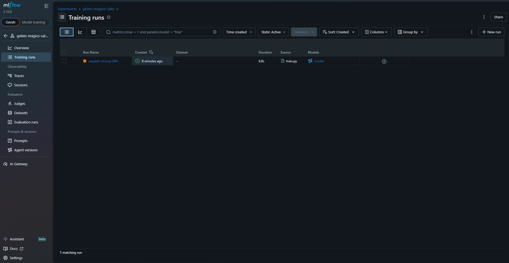
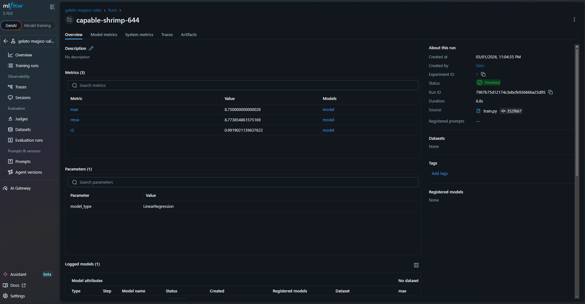
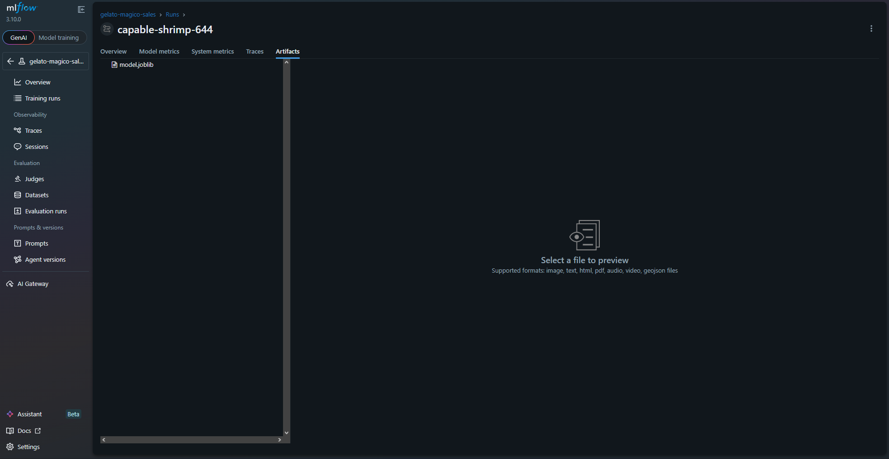

# 🍦 Previsão de Vendas de Sorvete com Machine Learning

Projeto desenvolvido para prever a quantidade de sorvetes vendidos com base na temperatura do dia, utilizando Regressão Linear e MLflow para rastreamento de experimentos.

---

## 📌 Problema de Negócio

A sorveteria **Gelato Mágico**, localizada em uma cidade litorânea, precisa prever a demanda diária de sorvetes para:

- Reduzir desperdícios
- Otimizar produção
- Maximizar lucros

A temperatura influencia diretamente nas vendas, então foi desenvolvido um modelo preditivo baseado nessa variável.

---

## 🧠 Solução Desenvolvida

Foi criado um modelo de **Regressão Linear** utilizando:

- Python
- Scikit-learn
- Pandas
- MLflow

O modelo foi treinado com dados simulados de temperatura vs vendas.

---

## 📊 Resultados Obtidos

Métricas registradas no MLflow:

- **MAE:** 8.75  
- **RMSE:** 8.77  
- **R²:** 0.99  

📌 O modelo explica aproximadamente **99% da variação nas vendas**, mostrando forte correlação entre temperatura e quantidade vendida.

---

## 🔬 Rastreamento com MLflow

O MLflow foi utilizado para:

- Registrar métricas
- Versionar o modelo
- Salvar artefatos
- Garantir reprodutibilidade

### 📸 Prints do Experimento

## 📸 Prints do Experimento

### Training Runs


### Métricas


### Artefatos


---

## 📁 Estrutura do Projeto

---

## 🚀 Como Executar

1️⃣ Instalar dependências:

```bash
pip install -r requirements.txt
python src/train.py
mlflow ui
```
# 📚 Aprendizados

Durante o desenvolvimento deste projeto, foi possível:

Aplicar conceitos de regressão

Avaliar métricas de desempenho

Utilizar MLflow para rastrear experimentos

Organizar projeto com estrutura reprodutível

Entender conceitos básicos de MLOps

# 🔮 Possíveis Melhorias

Testar outros modelos (Random Forest, Gradient Boosting)

Criar API para previsão em tempo real

Fazer deploy em ambiente cloud

Criar dashboard para visualização das previsões

---
